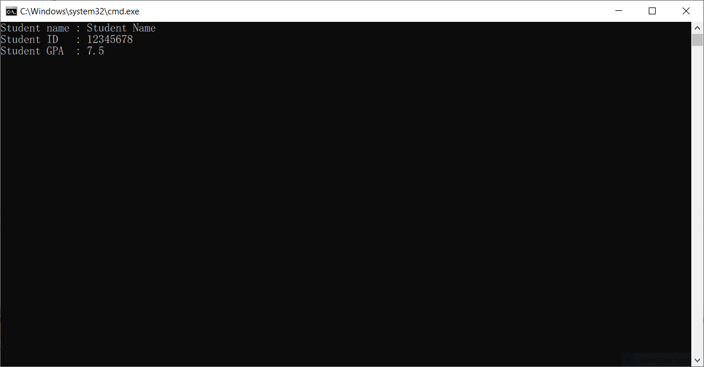
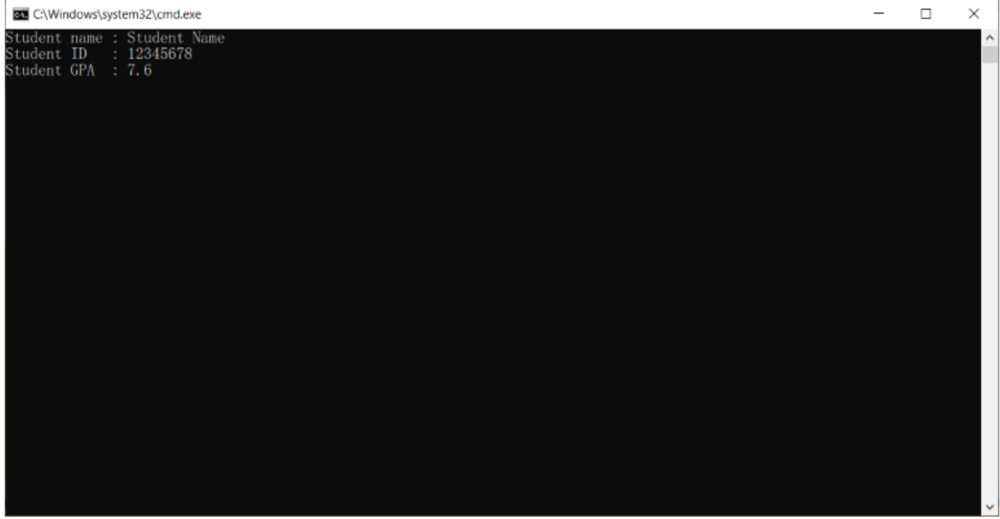
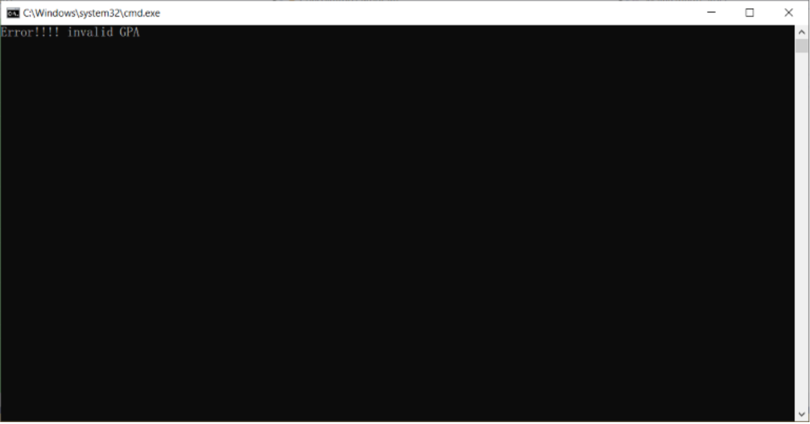
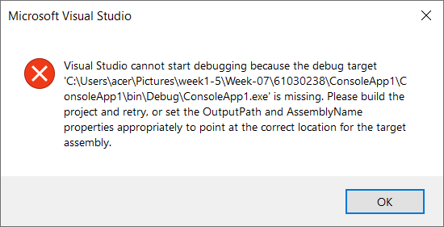
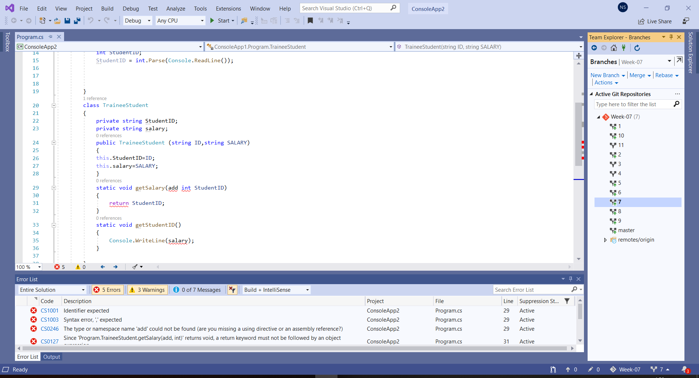
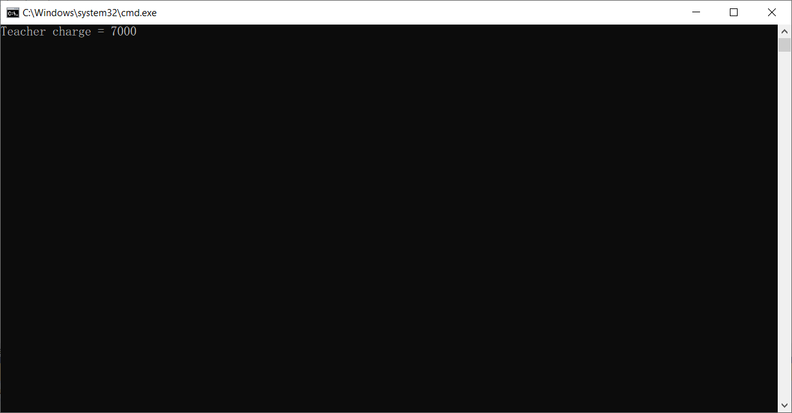
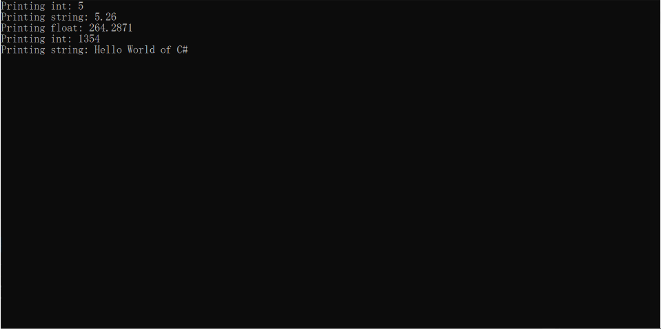
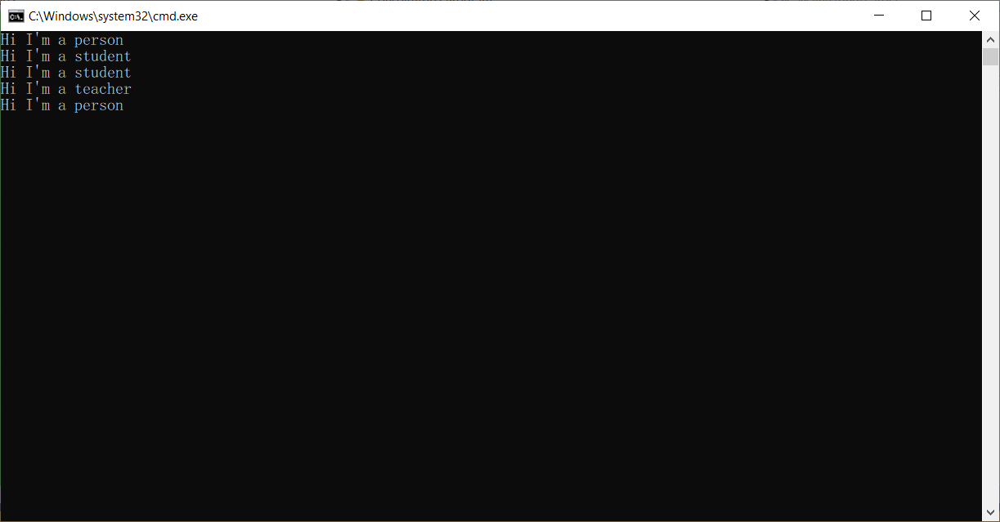
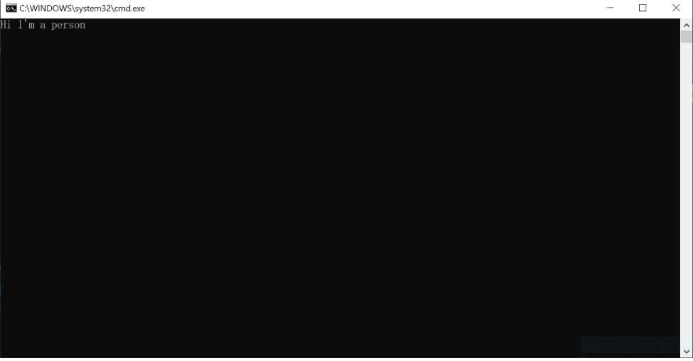

# การทดลองที่ 7 เรื่องคลาสและออปเจ็กต์ 1
## Class and Object


## วัตถุประสงค์เชิงพฤติกรรม
1. เพื่อให้นักศึกษาสามารถอธิบายแนวคิดในการใช้งานคลาสและออปเจ็กต์ได้
2. เพื่อให้นักศึกษาใช้งานคลาสสำเร็จรูปได้
3. เพื่อให้นักศึกษาสร้างคลาสเพื่อใช้งานเองได้

## [อ่าน -> ความรู้เบื้องต้น : แนวคิดในการเขียนโปรแกรมเชิงวัตถุ](Introduction-to-class.md)

## การทดลอง : การใช้งานคลาสในลักษณะต่างๆ

คลาส มีลักษณะเป็น reference type ซึ่งจะไม่เก็บค่าตัวแปรต่างๆ ไว้ในตัวเอง วิธีการสร้างวัตถุจากคลาส จะทำได้โดยการใช้คีย์เวิร์ด new และทำการเชื่อมต่อวัตถุเข้ากับตัวแปร โดยใช้ตัวดำเนินการ =  ดังตัวอย่าง

```csharp
Cat myCat = new Cat(); // create new object and then assign reference to variable
Cat myCat2 = myCat;    // copy object's reference to another one.
```

โดยปกติ ตัวภาษา C# เองจะไม่ได้จัดเตรียมคลาสใดๆ ไว้ให้เลย แต่เพื่ิอความสะดวกแก่ผู้ใช้ .NET Framework จึงรับหน้าที่จัดเตรียมไว้ให้ อย่างน้อยก็เพื่อความเข้ากันได้กับภาษาอื่นๆ ที่จัดเตรียมคลาสสำเร็จรูปไว้ให้ ผู้ที่สนใจสามารถศึกษา class library สำหรับภาษา C# ได้จาก หน้าเพจ Class Library Reference ของ Microsoft Developer Network [https://msdn.microsoft.com/en-us/library/ms306608.aspx] ซึ่งจะพบว่ามีอยู่เป็นจำนวนมาก 

การทดลองเรื่องการใช้งานคลาสและวัตถุ (object)

ทดลองสร้างคลาสโดยเขียนโปรแกรมตามตัวอย่างต่อไปนี้

```csharp
using System;

namespace ConsoleApp5
{
    class Program
    {
    	static void Main(string[] args)
    	{
        	Point myPoint = new Point();  // create new object
        	myPoint.X = 10;
        	myPoint.Y = 10;
        	Console.WriteLine("myPoint.x = {0}", myPoint.X);
        	Console.WriteLine("myPoint.y = {0}", myPoint.Y);
        	Console.ReadLine();
    	}
    }

    class Point          // class name
    {
    	private int x;    // fields
    	private int y;

    	public int X      // properties
    	{
        	get { return x; }
        	set { x = value; }
    	}

    	public int Y
    	{
        	get { return y; }
        	set { y = value; }
    	}
    }
}
```


* บรรทัดที่มีหมายเหตุ "// create new object"  เป็นการสร้างวัตถุใหม่โดยมีชนิด (class) เป็น Point
    * ทางด้านขวาของเครื่องหมาย = เป็นการสร้างวัตถุใหม่
*	ด้านซ้ายของเครื่องหมาย = เป็นตัวแปรชื่อ myPoint สำหรับเก็บค่าการอ้างอิงไปยังวัตถุนั้น 
* บรรทัดถัดมาเป็นการกำหนดค่าให้กับ properties X และ Y ของวัตถุ 

## การทดลองเรื่องการปกปิดข้อมูลหรือการห่อหุ้ม (Encapsulation)

### 1. การเข้าถึง fields แบบ public

ให้เขียนโปรแกรมตาม code snippet ต่อไปนี้ แล้วรันโปรแกรม

```csharp
class Program
{
    static void Main(string[] args)
    {
        Student su = new Student();
        su.Name = "Student Name";
        su.ID = "12345678";
        su.GPA = 3.5f;
        Console.WriteLine("Student name : " + su.Name);
        Console.WriteLine("Student ID   : " + su.ID);
        Console.WriteLine("Student GPA  : " + su.GPA);
        Console.ReadLine();
   }
}
class Student
{
    public string Name;
    public string ID;
    public float GPA;
}
```

* จากโปรแกรมด้านบน ให้เปลี่ยนบรรทัดที่ 8 เป็น 

```csharp
su.GPA = 7.5f;
```

* รันและสังเกตผลการทำงานของโปรแกรม มีสิ่งใดผิดปกติหรือไม่ อย่างไร

```text


```

จาก code ด้านบน จะเห็นว่าเราสามารถเข้าถึง fields ต่างๆ ของคลาส Student จากภายนอกได้อย่างอิสระ ซึ่งขัดกับหลักการปกปิดข้อมูลของ OOP เราจำเป็นต้องปกปิดข้อมูลดังกล่าว โดยการกำหนดให้ field ในคลาส Student มี modifier เป็น private ให้แก้ไขโปรแกรมเป็นดังนี้

```csharp
class Student
{
    private string Name;
    private string ID;
    private float GPA;
}
```

* รันและสังเกตผลการทำงานของโปรแกรม มีสิ่งใดผิดปกติหรือไม่ อย่างไร

```text


```


### 2. การเข้าถึง fields ผ่านทาง properties

เนื่องจากเราต้องการให้ fields ถูกปิดบังจากภายนอกจึงต้องกำหนด access modifier เป็น private ทำให้ผลที่ตามมาคือ ไม่สามารถกำหนดค่าให้กับ fields ต่างๆ ได้ เราจึงต้องพึ่งองค์ประกอบอีกอย่างหนึ่ง ของคลาสซึ่งสามารถมี modifier เป็น public  โดยไม่ขัดกับกฏของ OOP นั่นก็คือ properties

ให้แก้ไขคลาส Student โดยการเพิ่ม properties และเปลี่ยนชื่อตัวแปรสำหรับ fields เป็นตัวพิมพ์เล็กดังต่อไปนี้

```csharp
class Student
{
    private string name;
    private string id;
    private float gpa;
    public string Name
    {
        get { return name; }
        set { name = value; }
    }
    public string ID
    {
        get { return id; }
        set { id = value; }
    }
    public float GPA
    {
        get { return gpa; }
        set { gpa = value; }
    }
}
```

* รันและสังเกตผลการทำงานของโปรแกรม มีสิ่งใดผิดปกติหรือไม่ อย่างไร

```text


```


### 3. การตรวจสอบความถูกต้องของข้อมูลโดย properties

การใช้งาน properties มีประโยชน์ในเรื่องการควบคุมการเข้าถึงข้อมูล (ผ่านเมธอด getter และ setter) จากตัวอย่างด้านบนจะพบว่า GPA ยังคงมีค่าเป็น 7.5 ซึ่งมีค่าเกินปกติ 4.0 ซึ่งเราสามารถตรวจสอบความถูกต้องของข้อมูล ได้ในเมธอด setter หรือ getter  ให้แก้โปรแกรมเป็นดังต่อไปนี้

```csharp
class Program
{
    static void Main(string[] args)
    {
        Student su = new Student();
        try
        {
            su.Name = "Student Name";
            su.ID = "12345678";
            su.GPA = 7.5f;
            Console.WriteLine("Student name : " + su.Name);
            Console.WriteLine("Student ID   : " + su.ID);
            Console.WriteLine("Student GPA  : " + su.GPA);
        }
        catch (Exception e)
        {
            Console.WriteLine(e.Message);
        }
        Console.ReadLine();
    	}
}
class Student
{
    private string name;
    private string id;
    private float gpa;
    public string Name
    {
        get { return name; }
        set { name = value; }
    }
    public string ID
    {
        get { return id; }
        set { id = value; }
    }
    public float GPA
    {
        get 
        { 
            return gpa; 
        }
        set 
        {
            if (value > 0.0 &&  value <= 4.0 )
                gpa = value;
            else
                throw (new Exception("Error!!!! invalid GPA"));
        }
    }
}

```

__อธิบายการทำงานของโปรแกรม__

โปรแกรมด้านบนนี้ จะมีการตรวจสอบความถูกต้องของข้อมูลโดยเมธอด setter ของคลาส Student  (ในบรรทัดที่ 43 - 49) ถ้าหากข้อมูลที่ป้อนไม่ถูกต้องจะมีการ throw exception และจะไปรับการ exception ในประโยค try-catch ของฝั่งผู้เรียก (ในบรรทัดที่  6 - 18) แต่ถ้าข้อมูลที่ป้อนอยู่ในขอบเขตที่ถูกต้อง จะรายงานผลออกมาตามปกติ (ในบรรทัดที่  11 - 13).

* ทดลองเปลี่ยนค่าให้อยู่ในขอบเขตที่ถูกต้อง แล้วรันและบันทึกผลการทดลอง

```text


```


### 4. การกำหนดวิธีการเข้าถึงข้อมูลภายในคลาส

โปรแกรมด้านบน ยังมีจุดอ่อนอีกประการหนึ่งคือ ผู้ใช้สามารถแก้ไข properties ที่ชื่อ  Name และ ID ของวัตถุที่สร้างจากคลาส Student ได้ (ในบรรทัดที่ 8 - 9) การป้องกันการแก้ไขข้อมูลจากภายนอก สามารถทำได้โดยการลบเมธอด setter ออกไปจาก property ของคลาส แต่ผลที่ตามมาก็คือ เราจะไม่สามารถกำหนดค่าเริ่มต้นให้กับวัตถุได้ แต่ยังโชคดีที่คลาสได้ให้ทางออกอย่างหนึ่งแก่เรา นั่นคือการใช้ constructor

จากโปรแกรมด้านบนเราจะพบว่า Name และ ID มี setter อยู่ ซึ่งเป็นหนทางเดียวที่จะนำข้อมูลเข้าไปยังคลาส เราต้องลบออกไป และเพิ่ม constructor ที่รับพารามิเตอร์จำนวน 2 ตัว (ได้แก่ Name และ ID) มาทำหน้าที่ดังกล่าวแทน เมื่อทำดังนั้นแล้ว เราจะได้คลาส Student ที่สามารถกำหนดชื่อและ ID ได้ในขณะสร้างวัตถุและไม่สามารถแก้ไขในภายหลังได้
ให้แก้โปรแกรมเป็นดังต่อไปนี้

```csharp
class Program
{
    static void Main(string[] args)
    {
        Student su = new Student("Student Name", "12345678");
        try
        {
            // su.Name = "My name";
            su.GPA = 3.5f;
            Console.WriteLine("Student name : " + su.Name);
            Console.WriteLine("Student ID   : " + su.ID);
            Console.WriteLine("Student GPA  : " + su.GPA);
        }
        catch (Exception e)
        {
            Console.WriteLine(e.Message);
        }
        Console.ReadLine();
    }
}
class Student
{
    private string name;
    private string id;
    private float gpa;

    public Student(string Name, string ID)
    {
        this.name = Name;   // assign auto variable to the field
        this.id = ID;  	 
    }

    public string Name
    {
        get { return name; }
    }
    public string ID
    {
        get { return id; }
    }
    public float GPA
    {
        get 
        { 
            return gpa; 
        }
        set 
        {
            if (value > 0.0 &&  value <= 4.0 )
                gpa = value;
            else
                throw (new Exception("Error!!!! invalid GPA"));
        }
    }
}
```

* จงอธิบายการทำงานของโปรแกรมด้านบน ว่าเกิดอะไรขึ้น เพราะอะไร
* ให้ทำการ uncomment บรรทัดที่ 8 (ลบ  // ด้านหน้า su.Name = "My name"; ออกไป) แล้วรันโปรแกรม พร้อมทั้งบันทึกผล และอธิบายให้เหตุผลประกอบ
* ทดลองเปลี่ยน GPA เป็นค่าที่มากกว่า 4.0  ผลที่ได้เป็นเช่นไร

```text


```

### สรุปผลการทดลอง

```text
ปกติ


```


### คำถาม

นักศึกษาที่เรียนในชั้นปีที่ 3 ของภาควิชาครุศาสตร์วิศวกรรม จะต้องออกฝึกงานในสถานประกอบการด้านอุตสาหกรรม นักศึกษาจะได้รับเงินเดือนในการทำงาน ตามค่าแรงขั้นต่ำ (ปัจจุบัน คือ 300 บาท) แต่ไม่เกิน 450 บาทต่อวัน
 
 

ให้เขียนคลาส TraineeStudent ที่มี field ชื่อ StudentID และ salary โดยทั้งคู่จะถูกกำหนดค่าผ่าน constructor แต่จะมีเมธอดที่ชื่อ getSalary() และ getStudentID() ไว้อ่านค่าตัวแปร field ทั้งสอง

## การทดลองเรื่องการสืบทอดคุณสมบัติ (Inheritance)

ในโลกแห่งความเป็นจริง วัตถุทุกชนิด จะแบ่งปันหรือมีคุณสมบัติและความสามารถร่วมกันอยู่เสมอ ยกตัวอย่างเช่น อาชีพครู ที่มีหลากหลายระดับ แต่มีคุณสมบัติบางอย่างร่วมกันเช่น บทบาทหน้าที่ ความรับผิดชอบ อัตราเงินเดือน เงินประจำตำแหน่ง เป็นต้น ในการทดลองเรื่องการสืบทอดคุณสมบัตินี้ เราจะใช้ลำดับการสืบทอดคุณสมบัติของอาชีพครู เป็นวัตถุในการทดลอง ให้พิจารณารูปต่อไปนี้ 

<p align = "center">
</p>

## การทดลอง

### 1. สร้างคลาสชื่อ Teacher ไว้ด้านล่างของคลาส Program

```csharp
class Teacher
{
    // constructor (for initial private/protected variables)
    public Teacher(string name, float billingRate)
    {
        this.name = name;
        this.billingRate = billingRate;
    }
    // figure out the charge based on teacher's rate
    public float CalculateCharge(float hours)
    {
        return (hours * billingRate);
    }
    // return the name of this type
    public string TypeName()
    {
        return ("Teacher");
    }
    private string name;
    protected float billingRate;
}
```

### 2. แก้ไขเมธอด Main()

หมายเหตุ หมายเลขบรรทัด มีไว้เพื่ออธิบายการทำงานของโปรแกรม (ถ้ามี) อาจจะไม่ตรงกับหมายเลขบรรทัดในโปรแกรม 

```csharp
static void Main(string[] args)
{
    Teacher teacher = new Teacher("Tom", 350f);
    // teacher work for 20Hr/month
    Console.WriteLine("{0} charge = {1}", teacher.TypeName(), 
        teacher.CalculateCharge(20f)); 
    Console.ReadLine();
}
```

* รันและสังเกตผลการทำงานของโปรแกรม มีสิ่งใดผิดปกติหรือไม่ อย่างไร

```text

ไม่สามารถรันได้


```


* อธิบายการทำงาน ตามที่เข้าใจ


```text


```

### 3. ให้สร้างคลาสชื่อ Professor ซึ่งสืบทอดคุณสมบัติจากคลาส Teacher ดังต่อไปนี้

```csharp
class Professor : Teacher
{
    private float emolument;  // เงินประจำตำแหน่ง
    
    public Professor(string name, float billingRate): base(name, billingRate)
    {
    }
   	 
    public Professor(string name, float billingRate, float emolument) 
    : this(name, billingRate)
    {
        this.emolument = emolument;
    }
   	 
    // new function, because it's different than the base version
    public new float CalculateCharge(float hours)
    {
        if (hours < 1.0F)
            hours = 1.0F; // minimum charge.
        return (hours * billingRate) + emolument;
    }
    // new function, because it's different than the base version
    public new string TypeName()
    {
        return ("Professor");
    }
}
```

ในคลาส Professor นี้จะมี constructor จำนวน 2 ตัว คือ ตัวที่ 1 จะพ้องรูปกับคลาส Teacher ส่วนตัวที่ 2 จะมีการเพิ่มพารามิเตอร์มา 1 ตัว สำหรับรองรับการใส่ค่าเงินประจำตำแหน่ง
เนื่องจาก constructor เป็นเมธอดที่ไม่สามารถสืบทอดผ่านการทำ inheritance ได้ ดังนั้นใน derived class  ทุกตัว เราต้องเขียน constructor ไว้เสมอ ซึ่งในคลาส professor นี้มี constructor จำนวน 2 ตัวโดยตัวแรก มีรูปแบบเป็น 

```csharp
public Professor(string name, float billingRate): base(name, billingRate)
```
หมายความว่า constructor ตัวนี้รับพารามิเตอร์ในขณะสร้างวัตถุเป็นจำนวน 2 พารามิเตอร์ แต่เนื่องจากตัวแปรทั้งสองที่จะนำค่าไปเก็บ มี accessor เป็น private และ protected จึงต้องส่งต่อให้ constructor ของ base class ช่วยดำเนินการเก็บลงใน fields ซึ่งวิธีการดังกล่าวทำได้โดยใช้คำสั่ง : base(name, billingRate) ถ้าหากเราไม่เขียน constructor ตัวนี้ ก็จะไม่สามารถนำค่าไปเก็บใน fields ทั้งสองได้ และค่าใน fields ทั้งสองจะมีค่าเป็น default value ส่วน constructor ตัวที่สองจะรับพารามิเตอร์ในขณะสร้างวัตถุเป็นจำนวน 3 พารามิเตอร์ โดยพารามิเตอร์ที่เพิ่มเข้ามาคือเงินประจำตำแหน่ง (float emolument) 

```csharp
public Professor(string name, float billingRate, float emolument) 
    : this(name, billingRate)
```

วิธีการที่ง่ายและตรงไปตรงมาสำหรับ constructor ตัวนี้ก็คือ เราจะนำพารามิเตอร์ตัวที่ 3 ไปเก็บในฟิลด์ private float emolument ส่วนพารามิเตอร์ 2 ตัวแรกจะส่งให้ constructor ตัวที่หนึ่งรับไปดำเนินการ ด้วยคำสั่ง : this(name, billingRate) ซึ่งก็จะทำหน้าที่เรียก constructor ใน base class มาทำงาน

### 3. แก้ไขเมธอด Main()
หมายเหตุ หมายเลขบรรทัด มีไว้เพื่ออธิบายการทำงานของโปรแกรม (ถ้ามี) อาจจะไม่ตรงกับหมายเลขบรรทัดในโปรแกรม 

```csharp
static void Main(string[] args)
{
    Teacher teacher = new Teacher("Tom", 350f);
    Professor prof = new Professor("Jerry", 500f, 5000f);
    // teacher work 20Hr/month
    Console.WriteLine("{0} charge = {1}", teacher.TypeName(),
        teacher.CalculateCharge(20f));
    // professor work 12Hr/month
    Console.WriteLine("{0} charge = {1}", prof.TypeName(),
        prof.CalculateCharge(12F));
    Console.ReadLine();
}
```

* รันและสังเกตผลการทำงานของโปรแกรม มีสิ่งใดผิดปกติหรือไม่ อย่างไร
 
```text


```

* อธิบายการทำงาน ตามที่เข้าใจ

```text

มีการประมวรผลที่คลาสลูก


```

### หมายเหตุ

การใช้งานคลาสเพื่อการสืบทอดคุณสมบัติยังมีรายละเอียดปลีกย่อยอีกหลายประการ ซึ่งจะได้เรียนในวิชา Object Oriented Programming

## การทดลองเรื่องการพ้องรูป (Polymorphism)

### 1. การพ้องรูปแบบ static polymorphism

### 1.1 Method overloading 

การพ้องรูปแบบ static polymorphism ในกรณี method overloading จะเกิดขึ้นกับเมธอดในคลาสเดียวกัน ให้เขียนโปรแกรมต่อไปนี้ แล้วรันและสังเกตผลการทำงานของโปรแกรม 
(โปรแกรมนี้ยังรันไม่ได้ ต้องเพิ่มส่วน  using ก่อน)

```csharp
class Program
{
    void print(int i)
    {
        Console.WriteLine("Printing int: {0}", i);
    }
    
    void print(double f)
    {
        Console.WriteLine("Printing float: {0}", f);
    }

    void print(string s)
    {
        Console.WriteLine("Printing string: {0}", s);
    }
    
    static void Main(string[] args)
    {
        Program p = new Program();
        p.print(5);
        p.print((5.26f).ToString());
        p.print(264.2871);
        p.print((int)1354.23);
        p.print("Hello World of C#");
        Console.ReadKey();
    }
}
```

* รันและสังเกตผลการทำงานของโปรแกรม มีสิ่งใดผิดปกติหรือไม่ อย่างไร

```text

 


```

* อธิบายการทำงาน ตามที่เข้าใจ

```text

มีการประมวรผลที่คลาสลูก


```

### 1.2 Operator overloading 

ในกรณี operator overloading นี้จะช่วยให้เราสามารถใช้งานวัตถุได้อย่างเป็นธรรมชาติมากขึ้น เช่นการบวกเวคเตอร์ 2 ตัวเข้าด้วยกันโดยตัวดำเนินการบวก หรือการกำหนดค่าลบให้กับเวคเตอร์ด้วยตัวกระทำลบแบบ unary ให้เขียนโปรแกรมต่อไปนี้ พร้อมทั้งรันและบันทึกผลการทำงานของโปรแกรม

```csharp
class Program
{
    static void Main(string[] args)
    {
        Vector v1 = new Vector(1, 4);
        Vector v2 = new Vector(8, 5);
        Vector v3 = v1 + v2;
        Console.WriteLine("vector v1 = " + v1);
        Console.WriteLine("vector v2 = " + v2);
        Console.WriteLine("vector v3 = " + v3);
        Console.WriteLine("-v3 = " + (-v3));
        Console.ReadKey();
    }
}
class Vector
{
    public Vector(int x, int y)
    {
        this.X = x;
        this.Y = y;
    }
    public int X { get; set; }  // X - accessor (property)
    public int Y { get; set; }  // Y - accessor (property)

    public override string ToString()
    {
        return string.Format("({0},{1})", X, Y);
    }
    // All operator overloads must be public and static.
    public static Vector operator +(Vector v1, Vector v2) //binary operator +
    {
        return new Vector(v1.X + v2.X, v1.Y + v2.Y);
    }
    public static Vector operator -(Vector v1)  //unary operator -
    {
        return new Vector(-v1.X, -v1.Y );
    }
}
```

* รันและสังเกตผลการทำงานของโปรแกรม มีสิ่งใดผิดปกติหรือไม่ อย่างไร
 
```text


```

* อธิบายการทำงาน ตามที่เข้าใจ

```text

มีการประมวรผลที่คลาสลูก


```

### 2. การพ้องรูปแบบ dynamic polymorphism

การพ้องรูปแบบ dynamic polymorphism จะเกิดขึ้นเมื่อใช้งานการพ้องรูปร่วมกับการสืบทอดคุณสมบัติ สมมติมีระบบคลาสดังรูปด้านล่างนี้ ซึ่งคลาส Student และ Teacher ต่างก็สืบทอดมาจากคลาส Person แต่จะมี modifier ที่ต่างกัน นั่นคือเมธอด SayHi() ของ Student มี modifier เป็น override แต่ของ Teacher มี modifier เป็น new

ในการสร้างวัตถุ เราสามารถสร้างวัตถุเป็นชนิดคลาสลูกแล้วนำไปกำหนดให้กับตัวแปรที่สร้างจากคลาสแม่ได้ เมื่อเรียกเมธอดในคลาสลูก ระบบจะวิ่งหาเมธอดที่ทำ polymorphism จนพบลำดับชั้นสุดท้ายแล้วเรียกขึ้นมาทำงาน 
เมธอดที่ไม่ถูกเรียกขึ้นมาทำงานในลำดับขั้นการสืบทอด จะเรียกว่ามันถูกซ่อนจากระบบ (ด้วยกระบวนการ method hiding) 

<p align = "center">
</p>

ให้สร้าง project เป็น Console Application (.NET Framework) แล้วเพิ่มคลาสต่อไปนี้ลงใต้คลาส Program

```csharp
class Person
{
    public virtual void SayHi()
    {
    	Console.WriteLine("Hi I'm a person");
    }
}

class Student : Person
{
    public override void SayHi()
    {
        Console.WriteLine("Hi I'm a student");
    }
}

class Teacher : Person
{
    public new void SayHi()
    {
        Console.WriteLine("Hi I'm a teacher");
    }
}
```

ในเมธอด Main ให้แก้โค้ดเป็นดังต่อไปนี้

```csharp
static void Main(string[] args)
{
    Person p = new Person();
    p.SayHi();
    Student s = new Student();
    s.SayHi();
    Person sp = new Student();
    sp.SayHi();
    Teacher t = new Teacher();
    t.SayHi();
    Person tp = new Teacher();
    tp.SayHi();
    Console.ReadKey();
}
```

* รันและสังเกตผลการทำงานของโปรแกรม มีสิ่งใดผิดปกติหรือไม่ อย่างไร

 
```text


```

* อธิบายการทำงาน ตามที่เข้าใจ

```text

ประมวรผลที่คลาสย่อย


```

* การประกาศแบบใด ที่ทำให้เกิด method overriding และ method hiding.

```text

เป็นการประกาศชื่อซ้ำ


```


## แบบฝึกหัด

<p align = "center">
 </p>

ให้ดัดแปลงโปรแกรมด้านบน เพื่อเพิ่มคลาส Professor ที่สืบทอดจากคลาส Teacher ดังแผนภาพด้านบน จากนั้นให้รันโปรแกรมและบันทึกผล โดยกำหนดให้คำสั่งในการเรียกใช้ดังต่อไปนี้ พร้อมทั้งอธิบายว่าเหตุใดจึงเป็นเช่นนั้น

### ข้อ 1.

```csharp
static void Main(string[] args)
{
    Person p = new Professor();
    p.SayHi();
    Console.ReadKey();
}
```
 
ปกติ
### ข้อ 2.

```csharp
static void Main(string[] args)
{
    Student p = new Professor();
    p.SayHi();
    Console.ReadKey();
}
```
เกิด error คลาส Student ไม่สามารถสร้างวัตถุใหม่ Professor ได้เพราะ Class Student ไม่ได้มี คลาส Professor เป็นคลาสย่่อย
### ข้อ 3.

```csharp
static void Main(string[] args)
{
    Teacher t = new Person();
    t.SayHi();
    Console.ReadKey();
}
```
กิด error คลาส Teacher ไม่สามารถสร้างวัตถุใหม่ Person ได้เพราะ Class Teacher เป็นเพียงคลาสย่อยเท่านั้น
