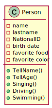

# แนะนำ/ทบทวนเรื่องคลาสและการใช้งาน
## ความรู้เบื้องต้น : แนวคิดในการเขียนโปรแกรมเชิงวัตถุ
แนวคิดในการเขียนโปรแกรมเชิงวัตถุ มี 3 กระบวนการหลักๆ คือ การปกปิดข้อมูลหรือการห่อหุ้ม (Encapsulation), การสืบทอดคุณสมบัติ (Inheritance) และการพ้องรูป (Polymorphism) การสร้างคลาสที่มีความสามารถรองรับกระบวนการต่างๆ ได้นั้น จำเป็นต้องมีองค์ประกอบในคลาสตามความเหมาะสม ในการทดลองนี้ เราจะมาศึกษาและฝึกใช้งานองค์ประกอบต่างๆ ของคลาสและการนำคลาสไปสร้างวัตถุ เพื่อให้เข้าใจแนวคิดและสามารถใช้งานได้อย่างถูกต้อง  

ในปี 1968 องค์การนาโต้ (NATO องค์การสนธิสัญญาแอตแลนติกเหนือ) ได้จัดสัมมนาเรื่อง Mass Produced Software Components    (การผลิตชิ้นส่วนซอฟต์แวร์เป็นจำนวนมาก) ที่ประเทศเยอรมัน เพื่อต่อสู้กับวิกฤตการณ์ซอฟท์แวร์ การสัมมนานี้วางรากฐานแนวคิดการทำซอฟท์แวร์ให้เป็นชิ้นส่วนย่อย (component) ผู้นำการสัมมนาเรียกแนวคิดนี้ว่า Component Oriented Programming (ย่อว่า COP) หรือการเขียนโปรแกรมโดยเน้นการสร้างชิ้นส่วน โดย component หมายถึง Object ที่ถูกสร้างขึ้นตามข้อกำหนดจำเพาะเพื่อตอบสนองเป้าหมาย 5 ประการคือ

1. นำกลับมาใช้ใหม่ได้
2. เป็นอิสระต่อสภาพแวดล้อม
3. ทำงานร่วมกับ component อื่นได้
4. ใช้วิธี Encapsulation
5. เป็นอิสระต่อการนำไปใช้และการปรับเปลี่ยนเวอร์ชัน

ภาษา C# เป็นภาษา OOP ที่สนับสนุนหลักการ COP อย่างจริงจัง ดังนั้นนอกจากการเรียนรู้เรื่องตัวภาษาแล้ว เราควรยึดถือตามหลักการของ COP และ OOP อย่างเคร่งครัด เนื่องจากมันถูกใช้เป็นกรอบความคิดในการออกแบบภาษา C# 

## การปกปิดข้อมูลหรือการห่อหุ้ม (Encapsulation)

การปกปิดข้อมูลหรือการห่อหุ้ม (Encapsulation) มีไว้เพื่อซ่อนรายละเอียดในการปฏิบัติงานของคลาส โดยคลาสที่ดีจะเปิดเผยเฉพาะส่วนที่ต้องการให้ผู้ใช้งานเห็นหรือเรียกใช้งานได้เท่านั้น แนวคิดในการห่อหุ้ม เกิดจากความต้องการนำคลาสมาสร้างวัตถุที่มีความยืดหยุ่นในการใช้งานมากที่สุด สามารถใช้งานทดแทนกันได้ ผู้ใช้ไม่จำเป็นต้องรู้กลไกการทำงานข้างใน เราเรียกกระบวนการคิดในลักษณะนี้ว่า Abstraction ซึ่งเกิดขึ้นขณะออกแบบคลาส โดยเราจะตัดส่วนที่ไม่จำเป็นทิ้งไป ให้พิจารณาตัวอย่างต่อไปนี้

คลาส Person มีคุณสมบัติ (Properties) รวมทั้งความสามารถ (Operations หรือ methods) ต่างๆ  ดังที่ปรากฏในแผนภาพ

<p align = "center">
</p>


เราจะเห็นว่าถ้า Person นี้ มาสมัครเป็นนักศึกษา จะมีคุณสมบัติหรือ ความสามารถบางอย่าง ที่ “เกิน” ความต้องการของสถาบันการศึกษา ซึ่งเราสามารถตัดส่วนเกินเหล่านั้นออกไปได้ เรียกกระบวนการตัดส่วนเกินออกไปว่าเป็นการทำ abstraction ให้กับคลาส ซึ่งในแต่ละระบบจะมีคุณสมบัติและความสามารถของ Person ที่แตกต่างกันไปตามความต้องการหรือความเหมาะสม
คำถาม แล้วเราจะตัด (คุณสมบัติและความสามารถ) อะไรทิ้งไป และคงเหลืออะไรไว้

## การสืบทอดคุณสมบัติ (Inheritance)

การสืบทอดคุณสมบัติ เป็นคุณลักษณะเด่นหนึ่งในสามประการของการคิดแบบ Object Oriented Programming ใช้สำหรับการเพิ่มความสามารถของคลาสที่สืบทอดคุณสมบัติ (Derived class) มาจากคลาสต้นแบบ (Base class) ตัวอย่างเช่น ยานพาหนะ (Vehicle) หมายถึงสิ่งประดิษฐ์ที่สามารถเคลื่อนที่ได้ สามารถบรรทุกผู้คน สัมภาระสิ่งของ จากต้นทางไปยังปลายทางได้ สมมติให้คุณสมบัติที่มีในยานพาหนะคือ การเคลื่อนที่และการบรรทุกสิ่งของสัมภาระหรือผู้โดยสาร เมื่อวิวัฒนาการของยานพาหนะในโลกมีมากขึ้นตามเวลาที่ผ่านไป เราจะได้เห็นยานพาหนะที่สามารถเคลื่อนที่ไปบนบก ในน้ำ ในอากาศ หรือแม้แต่ในอวกาศ ซึ่งจะมีคุณสมบัติจำนวนหนึ่งติดตัวเสมอคือ การเคลื่อนที่ และการบรรทุกสิ่งของสัมภาระหรือผู้โดยสาร  สิ่งประดิษฐ์ใดที่มีคุณสมบัติสอดคล้องกับยานพาหนะ เราก็จะเรียกรวมๆ ว่า ยานพาหนะ แต่พอพิจารณารายละเอียด จะพบว่า หากเรานำยานพาหนะมาใส่ล้อ ก็จะเป็นยานพาหนะทางบก ใส่ปีกก็จะเป็นยานพาหนะทางอากาศ ใส่จรวดขับเคลื่อนก็จะเป็นยานอวกาศ เป็นต้น  

## การพ้องรูป (Polymorphism)

หลักการพ้องรูป (Polymorphism) ในทาง Object Oriented Programming นั้น จะทำให้ระบบการสืบทอดคุณสมบัติมีความยืดหยุ่นในการใช้งาน  ใกล้เคียงความเป็นจริงในชีวิตประจำวันมากขึ้น ซึ่งในเรื่อง Polymorphism นี้จะมี 2 ชนิด ได้แก่

1. Static polymorphism หรือ compile time polymorphism หรือ early binding เป็นการทำ overloading ของเมธอดหรือตัวดำเนินการ (Method overloading หรือ Operator overloading)

2. Dynamic polymorphism หรือ run time polymorphism หรือ late binding จะมีประเด็นหลักอยู่ 2 เรื่องคือ  การกำหนดทับการกระทำ (Method overriding) และการปิดบังความสามารถ (Method hiding) ของคลาสต้นแบบ

__Method overloading__ เป็นการพ้องรูปของเมธอดที่อยู่ในคลาสเดียวกันแต่มี signature ต่างกัน (signature ที่ใช้แยกแยะความแตกต่างในการทำ Method overloading ได้แก่ จำนวนของพารามิเตอร์และชนิดของพารามิเตอร์ ส่วนชนิดของการส่งค่ากลับ ไม่มีผลในการทำ Method overloading)

__Operator Overloading__ เป็นการนำตัวดำเนินการมาใช้กับชนิดข้อมูลที่เรานิยามขึ้นใหม่ โดยใช้ตัวดำเนินการซ้ำกับชนิดข้อมูลอื่นๆ เช่นการนำตัวดำเนินการ + มาใช้กับข้อความ จะเป็นการเชื่อมข้อความเข้าด้วยกัน หรือใช้กับเวคเตอร์ใน 2 มิติ จะเป็นการหาผลบวกเวตเตอร์แบบหัวต่อหาง เป็นต้น 

__Method Overriding__ เป็นกรณีที่นักพัฒนารู้ว่าคลาสต้นแบบ (น่า) จะต้องมีการสืบทอดเพื่อนำไปใช้งานจริง จึงออกแบบให้คลาสที่สืบทอด สามารถมีวิธีการทำงานของตนเองได้ (โดยใช้เมธอดชื่อเดียวกันกับคลาสต้นแบบ) เช่น ยานพาหนะ มีการเคลื่อนที่  Move() แต่รายละเอียดของการเคลื่อนที่ทางบกคือ แล่นไปบนพื้น ทางน้ำคือแล่นไปบนผิวน้ำ ในอากาศคือการบิน เป็นต้น เราจะเห็นได้ว่า ไม่ว่าจะแล่นหรือบิน ก็คือการเคลื่อนที่ ดังนั้น ในการพัฒนาคลาสในระดับที่มีการสืบทอด จึงอนุญาตให้มีการใช้ชื่อเดียวแต่หลายวิธีการได้ เรียกว่า polymophism แบบ overriding

__Method Hiding__ เป็นกรณีที่นักพัฒนาต้องการลบความสามารถบางอย่างในคลาสที่รับสืบทอด แต่โดยความเป็นจริง ถ้าสืบทอดคลาสมาแล้ว เราจะได้คุณสมบัติและความสามารติดมาทุกอย่างและไม่สามารถตัดออกไปได้ (นอกจากจะไปลบ source code ของคลาสต้นแบบ  ซึ่งก็ไม่สามารถทำได้) อย่างไรก็ตาม เรามีวิธีการปิดบังความสามารถของคลาสต้นแบบ เช่น ยานพาหนะทางบก มีความสามารถในการเลี้ยว แต่รถไฟก็เป็นยานพาหนะทางบก ที่ไม่สามารถบังคับเลี้ยวได้ตามใจชอบ รถไฟจะต้องวิ่งไปตามราง ดังนั้นหากมีการใส่ความสามารถด้วยเมธอด Turn() ไว้ในคลาสต้นแบบ เราสามารถสืบทอดมาเป็นคลาสรถไฟ โดยที่เมธอด Turn() ของคลาสรถไฟจะไม่มีการกระทำใดๆ ภายในเมธอดนั้นเลย พร้อมทั้งใส่คีย์เวิร์ด new ไว้เป็น modifier เมื่อมีการใช้งานเมธอด Turn() ในคลาสรถไฟก็จะไม่มีการกระทำใดๆ เกิดขึ้น ซึ่งสอดคล้องกับความเป็นจริง

## ส่วนประกอบของคลาส

ในการสร้างคลาส จะพบว่ามีส่วนประกอบหลักๆ ดังต่อไปนี้

1. การประกาศชื่อคลาสและ body ของคลาส
2. Fields
3. Properties
4. Methods
5. Constructor (and Destructor)
6. ส่วนประกอบอื่นๆ

### 1. การประกาศชื่อคลาสและ body ของคลาส

การประกาศชื่อของคลาส มักจะประกาศให้เป็นคำนาม โดยมีรูปแบบการประกาศดังต่อไปนี้

```
[<attributes>] [<access-modifiers>] <class identifier> [:<base-class> [<,interface(s)>]] 
{ 
class-body 
}
```

เมื่อ 


__ตัวอย่างการประกาศคลาส__

```csharp
public class Student
{
    // class body
}
```
### 2. Fields

Fields ใช้สำหรับเก็บข้อมูลภายในคลาส ข้อมูลใน fields สามารถประกาศเป็นชนิดข้อมูลใดก็ได้  ซึ่งถ้ายึดตามหลัก OOP แล้ว Fields ทั้งหมดจะต้องมี access-modifier เป็น private เนื่องจากถ้าเราประกาศเป็น public แล้วจะขัดกับกฏการทำ encapsulation เป็นผลให้ไม่สามารถควบคุมการเข้าถึงข้อมูลจากภายนอก เราไม่ควรประกาศ fields เป็น public ยกเว้นในกรณีที่ไม่มีเวลาหรือในความเร่งรีบ  ถ้าต้องการเข้าถึง fields จากภายนอก ให้ใช้ Properties เพื่อเข้าถึงและควบคุมข้อมูลใน fields

__รูปแบบการประกาศ Field__

```csharp
Type Identifier [= value];  // Type = data type, Identifier = field name.
//  fields can be initialized by [= value]. 
```

ตัวอย่างการประกาศ Fields  

```csharp
public class Student
{
    // Fields declaration
    private string name;
    private string ID;
    private float GPA;
}
```

### 3. Properties

Properties เป็นคุณสมบัติของคลาส ที่เปิดเผยต่อโลกภายนอก ให้เห็นถึงช่องทางที่จะเข้าถึง fields ที่อยู่ภายใน แต่ไม่จำเป็นที่ทุกๆ field จะมี property ไว้คอยรองรับ เนื่องจากเราไม่จำเป็นต้องเปิดเผยข้อมูลทุกอย่างต่อโลกภายนอก เช่นในคลาสเครื่องคำนวณ อาจจะมี properties สำหรับตัวกระทำ ตัวถูกกระทำ ตัวดำเนินการ และ ผลลัพธ์ เป็น public ส่วนตัวทดรวมทั้งการกระทำอื่นๆ ที่ไม่ใช่คำตอบสุดท้ายของการคำนวณ ก็กำหนดให้เป็น private
เมธอดสำคัญที่ใช้งานคู่กับ properties คือเมธอดสำหรับการเข้าถึงข้อมูล (accessors) ประกอบด้วยเมธอดสำหรับการดึงค่าจากวัตถุ (getter) และเมธอดสำหรับการกำหนดค่าให้วัตถุ (setter) ในภาษา C# คือ get { }  และ set { } ตามลำดับ ซึ่ง accessor นี้สามารถใช้กำหนดลักษณะการเข้าถึงข้อมูลภายในวัตถุได้หลายรูปแบบ เช่น ถ้ามี getter เพียงอย่างเดียว เราจะได้ property แบบ read-only ถ้ามีทั้ง getter และ setter จะเป็น property แบบ read/write เป็นต้น

__รูปแบบการประกาศ properties__ 

```csharp
<property type> <property name> 
{
    set 
    {
        <statements>;
    }
    get 
    {
       <statements>; 
    }
}
```

ตัวอย่างการประกาศ Properties 

```csharp
public class Student
{
    // Fields declaration
    private string  name;
    private string id;
    private float gpa;

    // read-only property
    public string  Name
    {
        get { return name; }
    }

    // read-only property
    public string  ID
    {
        get { return id; }
    }

    // read/write property
    public float GPA
    {
        get { return gpa; }
        set { gpa = value; }
    }
}
```
### 4. Methods

เมธอดภายในคลาส มีหลักการเขียนและใช้งานเหมือนเมธอดทั่วไป ยกเว้นเมธอดที่มีชื่อเดียวกับชื่อคลาส จะเรียกว่า constructor (ดูรายละเอียดจากหัวข้อ constructor)

ถึงแม้ว่า modifier ของเมธอดจะสามารถกำหนดการเข้าถึงจากภายนอกเป็น public, private, protected, internal ได้ก็ตาม แต่เนื่องจากเมธอดมีขอบเขตอยู่ภายในคลาส หากมีการกำหนดระดับการเข้าถึงของคลาสไว้ต่ำกว่า ของเมธอด ก็จะมีการกำหนดระดับโดยใช้ modifier ของคลาสแทนที่ เช่น ประกาศเมธอดเป็น public แต่ประกาศคลาสเป็น private ก็จะทำให้เมธอดและที่ประกาศเป็น public ทั้งหมด มีขอบเขตการมองเห็นจากภายนอกสูงสุดที่ระดับ private เท่านั้น 

__รูปแบบการประกาศ method__

```csharp
<Return type> Identifier ([<Parameter list>])
{
    [<statements>;]
}
```

### 5. Constructor (and Destructor)

Constructor เป็นกลไกที่สำคัญอย่างหนึ่ง ที่ช่วยให้ Object Oriented Programming ทำงานได้อย่างมีประสิทธิภาพ นั่นคือ constructor จะเป็นตัวช่วยกำหนดค่าเริ่มต้นให้กับตัวแปร (fields) ต่างๆ ภายในคลาส ช่วยให้เราทำงานได้อย่างราบรื่น นอกจากนั้น ในแต่ละคลาส สามารถมี constructor ได้เป็นจำนวนไม่จำกัด ดังนั้น หน้าที่สำคัญอีกประการของ constructor  ก็คือการรับพารามิเตอร์สำหรับคลาส ในการใช้งานคลาส

จากข้อกำหนดที่ว่า คลาสต้องปกปิดข้อมูล จะทำให้ไม่มีหนทางใดที่จะกำหนดค่าตัวแปรในคลาส แต่เรายังมี constructor ที่สามารถรับพารามิเตอร์มาใส่ให้กับตัวแปรชนิด private ได้ในขณะที่เริ่มสร้างวัตถุ ดังตัวอย่างต่อไปนี้

```csharp
class Program
{
    static void Main(string[] args)
    {
        Student s1 = new Student("Prayuth", "60039999");
        Console.WriteLine("Student name = " + s1.Name +", ID = " + s1.ID);
    }
}
public class Student
{
    // Fields declaration
    private string name;
    private string id;
    private float gpa;

    public Student(string value1, string value2)
    {
        this.name = value1;
        this.id = value2;
    }

    // read-only property
    public string Name
    {
        get { return name; }
    }

    // read-only property
    public string ID
    {
        get { return id; }
    }

    // read/write property
    public float GPA
    {
        get { return gpa; }
    set { gpa = value; }
    }
}
```
จากโปรแกรมด้านบน properties ที่ชื่อ Name และ ID ของคลาส Student เป็นแบบ read only เราไม่สามารถกำหนดค่าให้กับ properties ทั้งสองตัว และไม่สามารถกำหนดค่าให้กับตัวแปร name และ id  ได้ แต่เราสามารถให้ constructor ช่วยรับเป็นพารามิเตอร์ไปกำหนดค่าให้กับตัวแปรทั้งคู่ได้ นอกจากนี้เรายังสามารถใช้ properties ทำการตรวจสอบความถูกต้องของข้อมูลได้ ซึ่งจะเรียนรู้กันในการทดลอง  

### 6. ส่วนประกอบอื่นๆ

ส่วนประกอบอื่นๆ ภายในคลาส เช่น event, delegate, indexer  เป็นเนื้อหาที่ยังไม่นำมาบรรจุไว้ในการทดลองนี้ 
